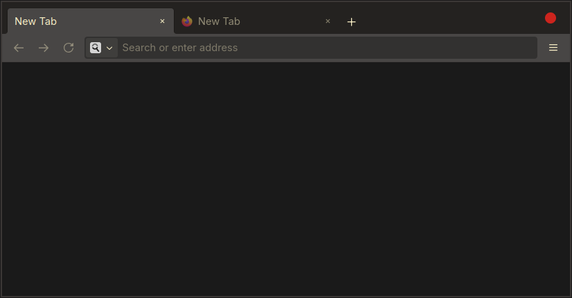

# gruvbox-gnomeish-firefox-theme

A minimal Firefox theme inspired by the aesthetics of Gruvbox and GNOME.

This project includes code originally from the [Firefox Dracula Theme](https://github.com/jannikbuscha/firefox-dracula), which was released under the MIT License. The code has been modified and redistributed under the terms of the GNU GPL v3.

Thank you for sharing your great work!

## Installation

1. In Firefox, open `about:support` and find "Profile Directory".
2. Click "Open Directory" or note the profile directory's path.
3. Copy the `chrome` directory into your profile directory.
4. Open `about:config`.
5. Set `toolkit.legacyUserProfileCustomizations.stylesheets` to `true`.
6. Set `svg.context-properties.content.enabled` to `true`.
7. Restart Firefox.
